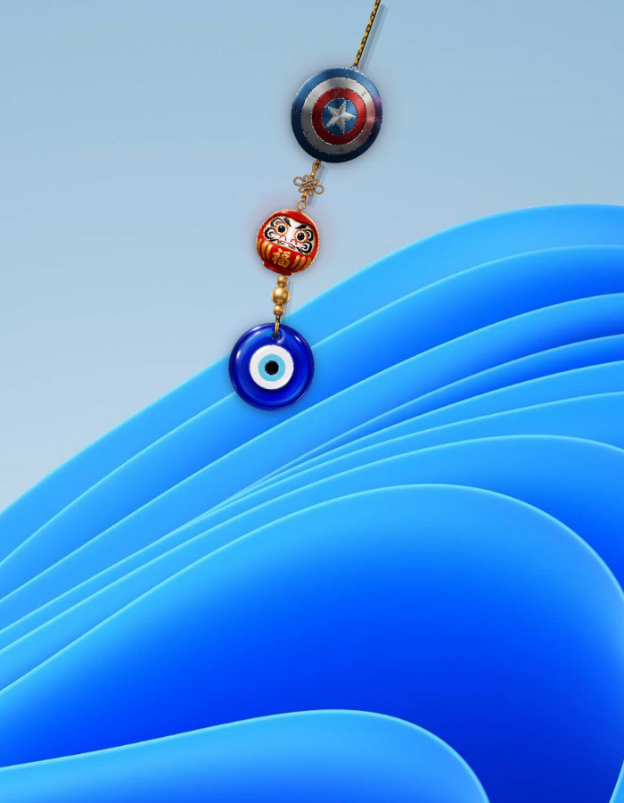
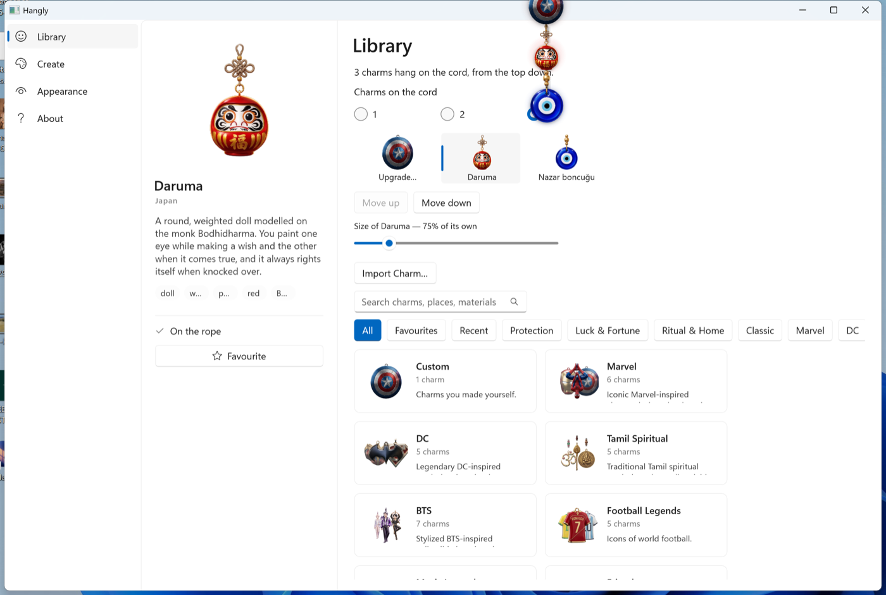

# Hangly for Windows

**Charms hang from a rope on your desktop.** Push one and it swings, with the weight
and the settle of a real one.

[](https://github.com/SharanCreatedThis/Hangly-Windows/actions/workflows/build.yml)
[](LICENSE)



Version 2.3.1. The Windows edition of [Hangly](https://www.sharancreatedthis.in/products/hangly),
in C# on .NET 9, WinUI 3 and Win2D, for Windows 10 (1809 or later) and Windows 11, x64
and ARM64. It has the same charms and features as
[Hangly for Mac](https://github.com/sharancreatedthis/Hangly), and the two ship together.

---

## Features

- **161 charms in 21 collections** — protection, luck, ritual, spirituality and the
  classics, and fan collections from Marvel and BTS to Pokémon and Air Jordan. Search
  them, favourite them, see what you hung recently.
- **Up to three charms on one rope**, in any order. Each adds its own weight, each
  gets its own stretch of cord in and out of it, and only the top one wears beads.
- **Nine ropes, each with its own physics.** A gold chain hangs and swings differently
  from a thread because its solver values are different, not its picture.
- **Real physics.** Twenty segments solved with Verlet integration at a fixed 240 Hz,
  whatever the display is doing. Beads ride the cord as particles of their own.
- **Charms that hang right.** The rope meets each charm where its artwork says it
  should, from the same measured anchor table as the Mac; a charm with a ring hangs
  from it by a small jump ring.
- **Make your own.** Drop a photo (PNG, JPEG, WebP or HEIC) on the charm, or use **Create**
  to import a picture or an SVG: the Creator Studio cuts the subject out of a photo, on this PC.
- **Motion and mood.** Elastic and mouse-reactive ropes, glow, time-of-day swing,
  charm sounds, and the Spider-Man entrance.
- **Out of the way.** Click-through everywhere but the charm; always on top or on the
  desktop; hides during full-screen video; about 1% of one core at rest; asks for no
  permissions.
- **Updates in the background.** Updates download by themselves and install at a
  quiet moment — when you lock the PC — or the next time Hangly quits or starts. A
  card under the charm offers **Update in Background** to install now.



## Installing

| Your PC | Download |
|---|---|
| Most PCs — Intel or AMD | [Hangly for Windows (x64)](https://www.sharancreatedthis.in/products/hangly/download/windows-x64) |
| Snapdragon, Surface Pro X and other ARM PCs | [Hangly for Windows (ARM64)](https://www.sharancreatedthis.in/products/hangly/download/windows-arm64) |

Not sure? **Settings → System → About → System type.** If it says "ARM-based
processor", take ARM64; otherwise x64. Every version is also on
[the releases page](https://github.com/SharanCreatedThis/Hangly-Windows/releases).

**Windows will warn you.** *"Windows protected your PC"* — click **More info**, then
**Run anyway**. Windows says this about any program that is not code-signed, and Hangly
is not signed yet; signing is being arranged through
[SignPath Foundation](https://signpath.org/), who sign open-source releases at no cost.

It installs for you only, needs no administrator, and lives in `%LOCALAPPDATA%\Hangly`.
Hangly sits in the notification area next to the clock; click it for the menu. Opening
it again takes you to your Library. To remove it: **Settings → Apps → Installed apps →
Hangly → Uninstall.**

## Keyboard

In Customize — the same shortcuts as Hangly for Mac, with Ctrl for ⌘:

| | |
|---|---|
| Library · Create · Appearance · About | Ctrl+1 · Ctrl+2 · Ctrl+3 · Ctrl+4 |
| Search the Library | Ctrl+F |
| Favourite the selected charm or rope | Ctrl+D |
| Move the selected charm up / down the rope | Alt+Up / Alt+Down |
| Show or hide the charm | Ctrl+Shift+O |
| Close the window | Ctrl+W |

## Building from source

You need the [.NET 9 SDK](https://dotnet.microsoft.com/download). Visual Studio is not
required — the Windows App SDK and the XAML compiler come through NuGet.

```powershell
git clone https://github.com/SharanCreatedThis/Hangly-Windows.git
cd Hangly-Windows

# The solver and models. These run anywhere, including on a Mac.
dotnet test tests/Hangly.Core.Tests/Hangly.Core.Tests.csproj

# The app. Windows only.
dotnet run --project src/Hangly.App/Hangly.App.csproj -c Release -r win-x64 -p:Platform=x64
```

On an ARM PC use `-r win-arm64 -p:Platform=ARM64`. Installers are built by
[`vpk`](https://velopack.io) in the release workflow,
[`.github/workflows/release.yml`](.github/workflows/release.yml). A build from source
sends nothing: only a release carries the analytics and registry configuration.

One warning for anyone tidying the project file: **`EnableMsixTooling` has to stay.**
It owns PRI generation, the compiled XAML lives inside the PRI, and removing it
produces an app with no XAML at all.

| Dependency | For |
|---|---|
| [Windows App SDK](https://github.com/microsoft/WindowsAppSDK) (WinUI 3) | Customize, the welcome window |
| [Win2D](https://github.com/microsoft/Win2D) | Drawing the rope and the charms |
| [Velopack](https://velopack.io) | Installing and updating |
| [ONNX Runtime](https://onnxruntime.ai) (DirectML) | Cutting out a subject in the Creator Studio |
| [SkiaSharp](https://github.com/mono/SkiaSharp) | Bitmaps: imported pictures, textures, thumbnails |

## How it is put together

```
src/Hangly.Core        no Windows types anywhere — runs and is tested on any machine
  Physics/             the Verlet solver, the cord curve, beads, the charm-stack layout
  Models/              charms, rope styles, the anchor table, time-of-day profiles
  Notifications/       the update card and broadcast rules
  Settings/, Registry/, Analytics/, Crashes/
src/Hangly.App         the Windows head
  Overlay/             the transparent click-through window, the frame loop, the renderer
  Customize/, Studio/  the Library, Create, Appearance and About window
  Tray/                the notification-area icon
  Interop/             the Win32 surface the overlay needs, and nothing else
  Services/            displays, launch at sign-in, updates, diagnostics
tests/Hangly.Core.Tests
tools/                 release notes, catalogue generation, and the checks below
reference/swift/       read-only copy of the Mac originals the port is checked against
```

Dependencies point inward: `Hangly.Core` knows nothing about WinUI, Win2D or Win32,
which is what lets "the rope never stretches beyond 1.02× its rest length" be a number
in a test rather than an opinion about a screenshot. The test suite is the Mac suite's
assertions with the same tolerances.

| Tool | What it does |
|---|---|
| `tools/release-notes.ps1` | Release notes from `CHANGELOG.md` (run by the release workflow) |
| `tools/generate-catalogue.py` | `CharmCatalog.Generated.cs`, from the Mac catalogue in `reference/swift/` |
| `tools/validate-release.ps1` | Checks a draft release's packages before it is published |
| `tools/hardening-checks.ps1` | Single instance and tray-icon survival, on a running copy |
| `tools/ui-smoke.ps1` | Drives the Customize window through UI Automation |
| `tools/measure-cpu.ps1` | CPU and memory of the installed app, swinging and settled |

## Documentation

| | |
|---|---|
| [Porting notes](Docs/Architecture/PORTING.md) | What was rewritten rather than transcribed, and why |
| [Parity](Docs/Architecture/PARITY.md), [visual parity](Docs/Architecture/VISUAL-PARITY.md) | How this edition matches the Mac |
| [Update infrastructure](Docs/Architecture/UPDATE-INFRASTRUCTURE.md) | Velopack, channels and feeds |
| [Release checklist](Docs/Release/RELEASE-CHECKLIST.md), [distribution](Docs/Release/DISTRIBUTION.md) | Cutting and shipping a release |
| [Code signing](Docs/Release/SignPath/) | The SignPath Foundation application |
| [Testing](Docs/Testing/TESTER-INSTRUCTIONS.md) | For people trying a build |
| [Known issues](KNOWN-ISSUES.md), [changelog](CHANGELOG.md) | |
| [Audits](Docs/Audits/) | Past readiness and audit reports, kept for the record |

The rope, stack and anchor design, and notifications, are documented once, in the Mac
repository's [architecture docs](https://github.com/sharancreatedthis/Hangly/tree/main/Docs/Architecture).

## Reporting a problem

[Open an issue.](https://github.com/SharanCreatedThis/Hangly-Windows/issues/new/choose)
`%APPDATA%\Hangly\hangly.log` holds the last run and is usually the whole answer. It can
include folder paths that contain your Windows user name, so look it over before attaching
it to a public issue. Reports from hardware the author does not have —
scaling other than 200%, several monitors, x64 PCs, Windows 10 — are the most useful
thing anybody can send. [CONTRIBUTING.md](CONTRIBUTING.md) has the rest; security
issues go by email, per [SECURITY.md](SECURITY.md).

## Privacy

Hangly keeps one record per installation — the nickname you type, your city (never
your address), that this is Windows, the processor, the Windows and Hangly versions,
when it was first and last used, and how often it has crashed — and counts a few usage
events. It never reads your Windows account name, your files or your location, and
asks for no permissions. [PRIVACY.md](PRIVACY.md) lists every field.

## Roadmap

- Code signing through SignPath Foundation, so Windows stops warning at install
- Starting on older, unpatched Windows 10 builds
- More charms in the Library, and new collections

## Licence

[MIT](LICENSE) for the code.

The charm artwork, the branding and the Hangly name are not MIT — see
[NOTICE.md](NOTICE.md). Build it, fork it, change it; please do not ship the artwork as
your own.
